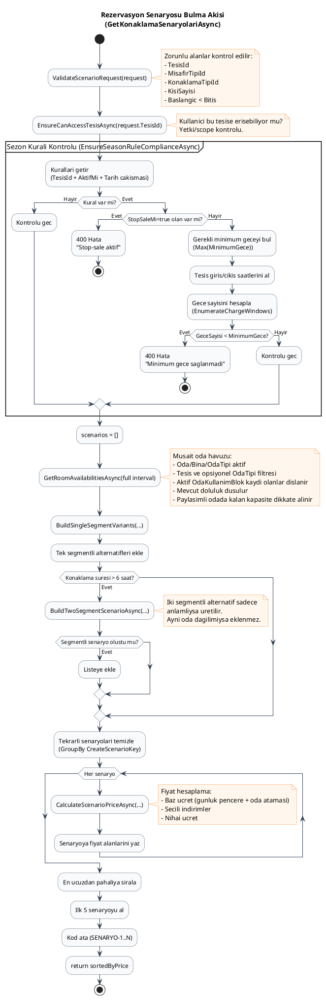
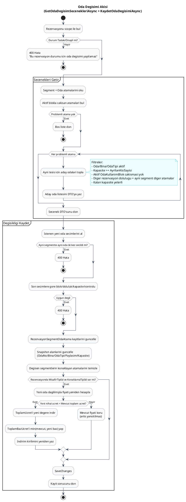
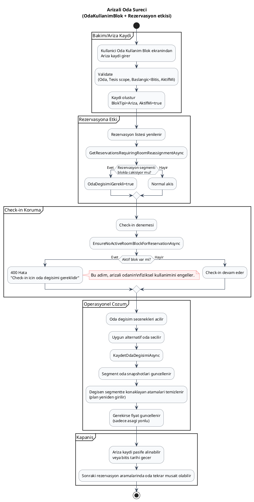

# STYS

Bu repository, STYS backend (`backend`), frontend (`frontend`), platform modulleri (`platform`) ve test projelerini (`tests`) icerir.

## Diger Dokumanlar

- Kurumsal tanitim brosuru: [docs/tanitim-brosuru.md](docs/tanitim-brosuru.md)
- Kurumsal sunum deck'i: [docs/kurumsal-sunum-deck.md](docs/kurumsal-sunum-deck.md)
- Demo toplantisi ozellik akisi: [docs/demo-toplantisi-ozellik-akisi.md](docs/demo-toplantisi-ozellik-akisi.md)

## Docker Ile Test Ortami

Tam Docker test ortami icin:

1. `.env.example` dosyasini `.env` olarak kopyalayin.
2. Gerekli gizli degerleri guncelleyin:
   - veritabani alanlari:
     - `STYS_DB_HOST`
     - `STYS_DB_PORT`
     - `STYS_DB_NAME`
     - `STYS_DB_USER`
     - `STYS_DB_PASSWORD`
   - `STYS_JWT_KEY`
   - gerekirse JWT sureleri:
     - `STYS_JWT_ACCESS_MINUTES`
     - `STYS_JWT_REFRESH_DAYS`
     - `STYS_JWT_RETENTION_DAYS`
   - gerekirse rate limit ayarlari:
     - `STYS_RATE_LIMIT_PERMIT_LIMIT`
     - `STYS_RATE_LIMIT_WINDOW_SECONDS`
     - `STYS_RATE_LIMIT_QUEUE_LIMIT`
   - gerekirse log ayarlari:
     - `STYS_LOG_FILE_PATH`
     - `STYS_LOG_RETAINED_FILE_COUNT_LIMIT`
     - `STYS_LOG_LEVEL_DEFAULT`
3. Uygulamalari ayaga kaldirin:

```powershell
docker compose up -d --build
```

Varsayilan erisimler:

- Frontend: `http://localhost:8080`
- Swagger: `http://localhost:8080/swagger/`
- MSSQL: `localhost,14333`

Notlar:

- Frontend container'i `nginx` ile servis edilir.
- Browser tarafindaki `/api/*` istekleri otomatik olarak backend container'ina proxy edilir.
- `/swagger/*` ve `/health/*` istekleri de frontend container'i uzerinden backend'e proxy edilir.
- Backend host portu disa acilmaz; API ve Swagger erisimi sadece frontend reverse proxy uzerinden saglanir.
- `/swagger/` basic auth ile korunur. Kimlik bilgileri `.env` icindeki `STYS_SWAGGER_AUTH_USERNAME` ve `STYS_SWAGGER_AUTH_PASSWORD` alanlarindan gelir.
- Backend container'i acilis sirasinda `TodIdentityDbContext` ve `StysAppDbContext` migration'larini uygular.
- JWT ve benzeri runtime ayarlari `docker-compose.yml` icindeki environment alanindan, `.env` dosyasi ile override edilebilir.
- Database, JWT, rate limiting ve log ayarlari `.env` dosyasinda ayri section'lar halinde yonetilir.
- Test ortaminda Swagger'i kapatmak istersen `.env` icinde `STYS_ENABLE_SWAGGER=false` yapabilirsin.
- Servisler explicit network'lerde calisir:
  - `stys-edge`: disa acilan frontend katmani
  - `stys-internal`: frontend, backend ve mssql ic haberlesmesi
- Windows ortaminda SQL Server data host bind mount yerine Docker named volume icinde tutulur: `stys_mssql_data`.
- Backend loglari hostta `./Data/logs/backend` klasorune yazilir.
- Nginx access/error loglari hostta `./Data/logs/frontend` klasorune yazilir.

## Docker Image Push

ACR veya baska bir OCI registry'ye backend ve frontend image'larini push etmek icin:

```powershell
.\scripts\push-images.ps1 -RegistryName todregistry
```

Bu komut:

- `az acr login --name todregistry`
- `docker compose build backend frontend`
- `docker compose push backend frontend`

akisini calistirir.

Varsayilan image isimleri:

- backend: `todregistry.azurecr.io/stys/backend:<tag>`
- frontend: `todregistry.azurecr.io/stys/frontend:<tag>`

Varsayilan tag:

- calisma zamani damgasi (`yyyyMMddHHmmss`)

Istersen tag'i elle verebilirsin:

```powershell
.\scripts\push-images.ps1 -RegistryName todregistry -Tag v1.0.0
```

Registry server'i dogrudan vermek istersen:

```powershell
.\scripts\push-images.ps1 -RegistryServer todregistry.azurecr.io -Tag test-20260401 -SkipLogin
```

Compose image referanslari `.env` ile de override edilebilir:

- `STYS_BACKEND_IMAGE`
- `STYS_FRONTEND_IMAGE`
- `STYS_IMAGE_TAG`

## Remote Deploy

Test veya hedef sunucuda, `mssql` container'ina dokunmadan sadece `backend` ve `frontend` image'larini registry'den cekip guncellemek icin:
Ilk kurulumda `mssql` yoksa script onu bir kez ayaga kaldirir. `mssql` zaten calisiyorsa dokunmaz.

```powershell
.\scripts\deploy-remote.ps1
```

Bu komut sunlari yapar:

- `mssql` yoksa veya calismiyorsa `docker compose up -d mssql`
- `docker compose pull backend frontend`
- `docker compose up -d --no-deps backend frontend`

Eger deploy server'da docker login yoksa:

```powershell
.\scripts\deploy-remote.ps1 `
  -WithLogin `
  -RegistryServer todregistry.azurecr.io `
  -Username todregistry `
  -Password "<registry-password>"
```

Bu akista:

- `mssql` varsa korunur
- `mssql` sadece yoksa veya durmussa ayağa kaldirilir
- sadece uygulama katmani guncellenir

## Proje Yapisi

- `backend`: ASP.NET Core + EF Core domain ve API katmani
- `frontend`: Angular UI
- `platform`: Ortak platform kutuphaneleri (identity, persistence, aspnetcore)
- `tests`: Otomasyon testleri

## Rezervasyon Senaryo Akisi (PlantUML)



## Oda Degisimi ve Ucret Kurali (PlantUML)



## Arizali Oda Sureci (PlantUML)


