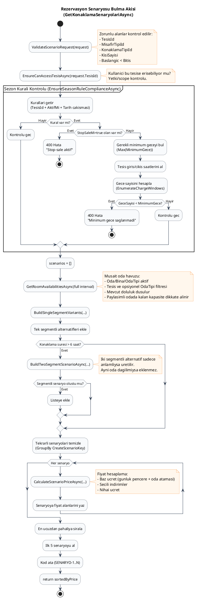

# STYS

Bu repository, STYS backend (`backend`), frontend (`frontend`), platform modulleri (`platform`) ve test projelerini (`tests`) icerir.

## Proje Yapisi

- `backend`: ASP.NET Core + EF Core domain ve API katmani
- `frontend`: Angular UI
- `platform`: Ortak platform kutuphaneleri (identity, persistence, aspnetcore)
- `tests`: Otomasyon testleri

## Rezervasyon Senaryo Akisi (PlantUML)

